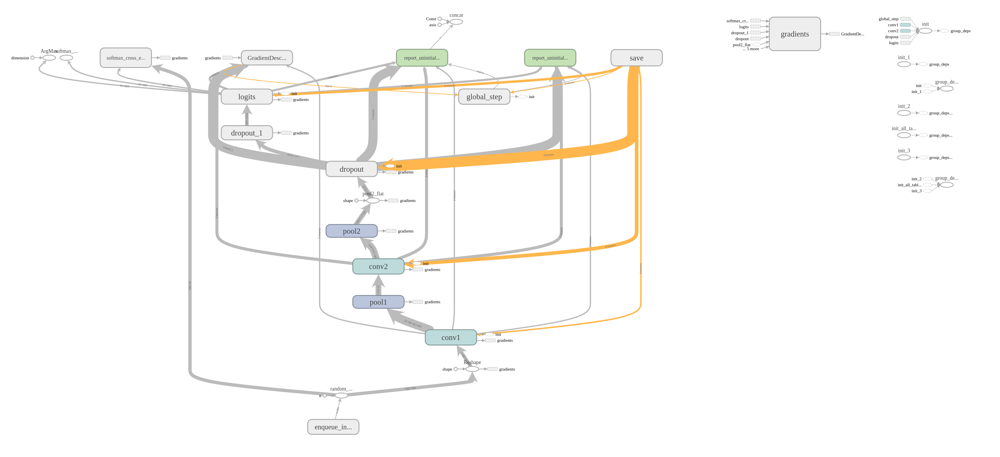
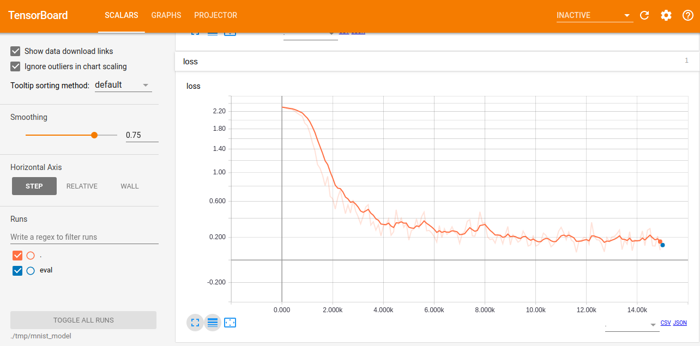

## Convolutional neural networks applied to MNIST dataset
This repository presents code for training CNN applied to MNIST dataset and corresponding results. Tensorflow framework was utilized in order to train and evaluate CNN for recognition of handwritten digits (0-9).

##### Architecture
Two convolutional layers with successive pooling layers were applied in this network. They are followed by one flattening layer and final fully connected layer. 


 


##### Results
  
After 15000 iterations of training following results were achieved:

| accuracy | global_step | loss |
|:--------:|:------------:|:----:|
|  0.1546  | 15001 |0.12912682|

```GradientDescentOptimizer``` was used to minimize the cost function. Results are presented on the following graph. 



_Note: in order to see results yourself, run ```tensorboard --logdir=./tmp/mnist_model```_ 